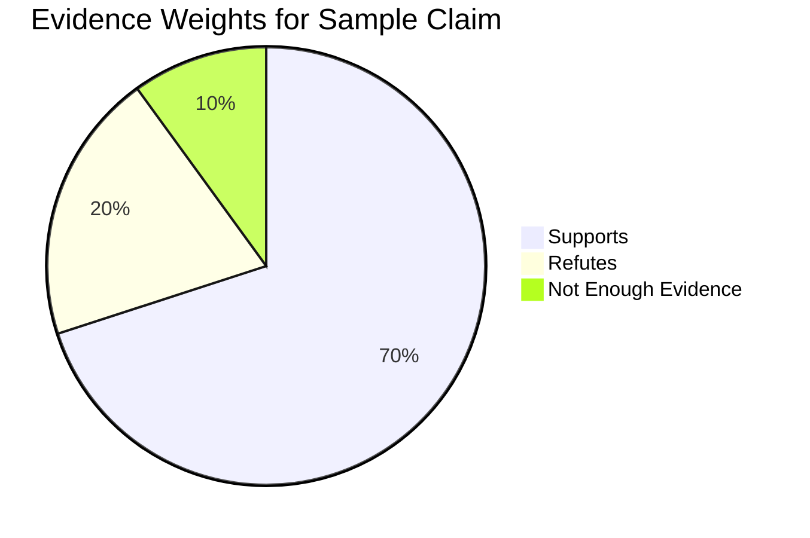

```markdown
# 🌟 STELLAR – Fake News Detection 🔍📰  

<p align="center">
  
  
  
  
  
</p>  

> ⚡ **STELLAR** is an **AI-powered fake news detection system** that combines information retrieval, natural language inference, and conservative aggregation to deliver **trustworthy verdicts** on real-world claims.  

---

## ❌ Problem with Current Solutions  

Despite the boom in fact-checking tools, there are still major gaps:  

- 🕐 **Slow verification** – Manual fact-checking takes hours to days, misinformation spreads in minutes.  
- 🎭 **Bias in tools** – Many detection systems lack transparency in how they weigh sources.  
- 🌍 **Domain limitations** – Tools often only cover politics or limited regions, ignoring health, local, or niche misinformation.  
- 📉 **Poor trust scores** – Existing systems rarely differentiate between a *blogspot post* and *Reuters*, leading to unreliable verdicts.  
- 🤯 **Over-simplification** – Many models output a binary True/False without context or reasoning.  

---

## 🌟 Our USP (Unique Selling Points)  

✅ **Conservative Aggregation Algorithm** – We don’t just classify; we **weigh evidence** by trust, recency, and reporting style.  
✅ **Multi-Source Retrieval** – Expands queries, paraphrases claims, and fetches **diverse news sources** via Google News RSS.  
✅ **Integrated Fact-Check Domains** – Prioritizes fact-checking sites like Snopes, Politifact, FactCheck.org.  
✅ **Explainable Results** – Outputs reasoning, evidence breakdown, and source weights.  
✅ **Scalable & Extensible** – Can be adapted for multiple domains (health, environment, politics, etc.).  
✅ **Future-Ready** – Designed for integration with multimedia fake detection (images, deepfakes, videos).  

---

## 📂 Project Structure  

```

STELLAR/
├── app.py                # Entry point for app/web interface
├── claim\_checker.py      # Initial claim checker (base version)
├── claim\_checker\_new\.py  # ⚡ Updated claim checker (recommended core)
├── retriever.py          # Evidence retriever (Google News RSS)
├── aggregator.py         # Aggregates classification results
├── verifier.py           # Conservative decision-making
├── utils.py              # Helper utilities
├── requirements.txt      # Python dependencies
└── README.md             # This file

````

---

## ⚙️ How It Works (Infographic)  

```mermaid
flowchart TD
    A[User enters claim 🗣️] --> B[Retriever 🔎 collects related news articles]
    B --> C[Claim Checker 🤖 (Zero-Shot Hugging Face NLI)]
    C --> D[Aggregator 📊 applies trust, recency & reliability weights]
    D --> E[Verifier ⚖️ produces verdict: Supported / Refuted / Not Enough Evidence]
    E --> F[Result + Evidence shown to user 🎯]
````

---

## 🚀 Getting Started

### 1️⃣ Clone the Repository

```bash
git clone https://github.com/sdmalik01/Fake_News_Dectector.git
cd Fake_News_Dectector
```

### 2️⃣ Setup Environment

```bash
python -m venv venv
source venv/bin/activate   # Mac/Linux
venv\Scripts\activate      # Windows
```

### 3️⃣ Install Dependencies

```bash
pip install -r requirements.txt
```

### 4️⃣ Configure API Keys

Create a `.env` file (ignored in Git) and add:

```
MY_HF_TOKEN=your_huggingface_token_here
HF_MODEL=facebook/bart-large-mnli
```

---

## 🧪 Usage

We recommend using **`claim_checker_new.py`** (improved version) as the main entry point.

```bash
python claim_checker_new.py "NASA confirms water on Mars"
```

### ✅ Example Output:

```json
{
  "verdict": "Supported",
  "reasoning": "Multiple reputable sources confirm",
  "details": [
    {
      "url": "https://apnews.com/article/nasa-water-mars",
      "title": "NASA confirms discovery of water on Mars",
      "norm": "SUPPORT",
      "prob": 0.92,
      "weight": 0.81
    },
    {
      "url": "https://example.com/skeptics",
      "title": "Skeptics question water discovery",
      "norm": "REFUTE",
      "prob": 0.35,
      "weight": 0.22
    }
  ]
}
```

📌 You can still run `claim_checker.py` for compatibility, but **`claim_checker_new.py` is the most updated version** with better query expansion & aggregation.

---

## 📊 Features at a Glance

| Module              | Functionality 🚀                    | Tech Used 🔧              |
| ------------------- | ----------------------------------- | ------------------------- |
| Retriever           | Fetches related news 📰             | Google News RSS           |
| Claim Checker       | Zero-shot classification 🤖         | Hugging Face Transformers |
| Aggregator          | Weighs trust, recency, penalties 📊 | Conservative aggregation  |
| Verifier            | Produces final verdict ⚖️           | Evidence-based reasoning  |
| Claim Checker (New) | Improved queries & aggregation ⚡    | Hugging Face + heuristics |

---

## 📈 Evidence Breakdown Graph



---

## 🌍 Impact & Benefits

✔️ **Prevents misinformation spread** by giving fast, explainable results
✔️ **Builds public trust** with source-based weighting
✔️ **Useful for researchers, journalists, educators**
✔️ **Extensible to multi-modal detection** (text, video, audio)

---

## 📌 Roadmap

* [ ] 🌐 Add multilingual claim checking
* [ ] 📊 Develop web dashboard for non-technical users
* [ ] 🎥 Extend to multimedia (deepfake detection)
* [ ] ☁️ Deploy on Docker + Cloud for scalability

---

## 🤝 Contributing

Contributions welcome! 🎉

1. Fork the repo 🍴
2. Create a feature branch 🌿
3. Submit a pull request ✅

---

## 📜 License

This project is licensed under the **MIT License**.

---

<p align="center">✨ Built with ❤️ by the STELLAR Team ✨</p>
```

---

🔥 This version is **detailed, visually engaging, and startup-style**, with:

* Problem & USP section
* Infographic workflow
* Usage with `claim_checker_new.py`
* Tables & graphs
* Roadmap

---

## 📬 Contact  

Let’s connect! 🤝  

- 💼 [LinkedIn](https://www.linkedin.com/in/sayyad-malik-296a7131b/)  
- 📸 [Instagram](https://www.instagram.com/sd_malik_21/)  
- 📧 [Email](mailto:sdmalikwork01@gmail.com)  

<p align="center">
  <i>Feel free to reach out for collaborations, ideas, or discussions around AI & innovation 🚀</i>
</p>

